# CONFIGURANDO UN FORMULARIO PERSONALIZADO 

Para crear un formulario personalizado con una integracion de google maps en esta ocasion utilizaremos [clappia.com](clappia.com) la cual es una plataforma de desarrollo low-code para la generación de aplicaciones.

Primero nos creamos una cuenta en [clappia.com](clappia.com) y nos pedirá ingresar un nombre de subdominio para el dominio [clappia.com](clappia.com), este nos servira mas adelante para generar un vinculo y compartir el enlace y de esta manera los usuarios llenen la información que la vamos a solicitar

Una vez que hemos creado la cuenta en [clappia.com](clappia.com) procedemos a generar un proyecto nuevo dando clic en **New App** 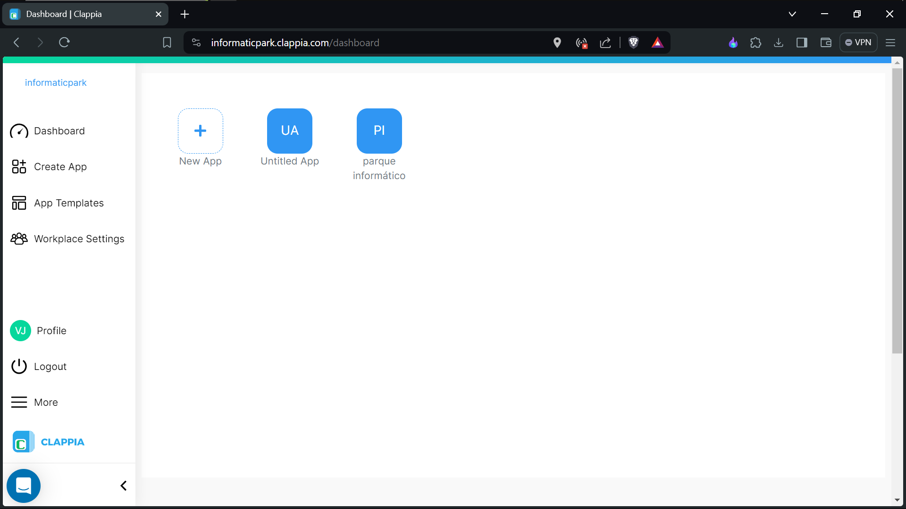

Una vez dentro de la aplicación la navegación se la realizada mediante las pestañas disponibles en la parte superior 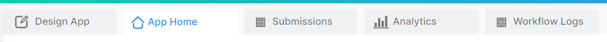

* La pestaña **Design App** hace referencia al espacio de trabajo en donde vamos a configurar y personalizar el formulario.
* La pestaña **App Home** nos sirve para tener una vista previa del funcionamiento y el comportamiento de nuestra aplicación.
* En la pestaña **submissions** se alojarán todos las respuestas que los usuarios hayan generado.

## Ahora nos ubicamos en la pestaña **Design App**
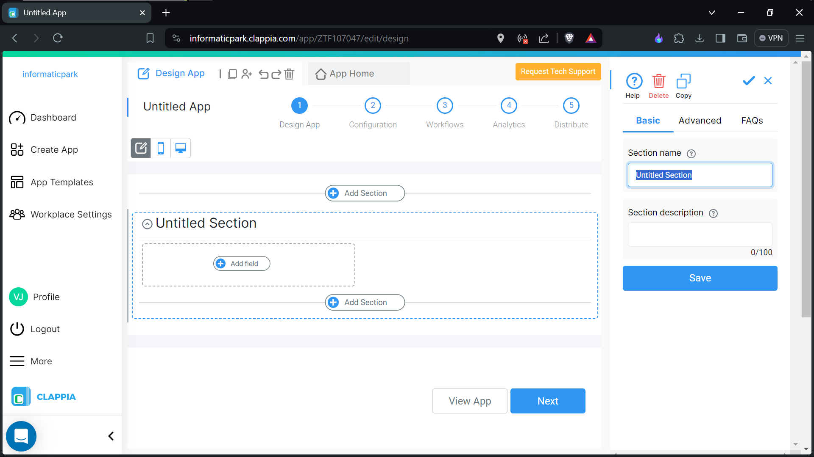
### De estructura de la pestaña

1. La navegacion en la aplicación se lo realiza mediante secciones para lo cual es necesario crear una nueva sección y dentro de las secciones es donde podremos insertas los componentes
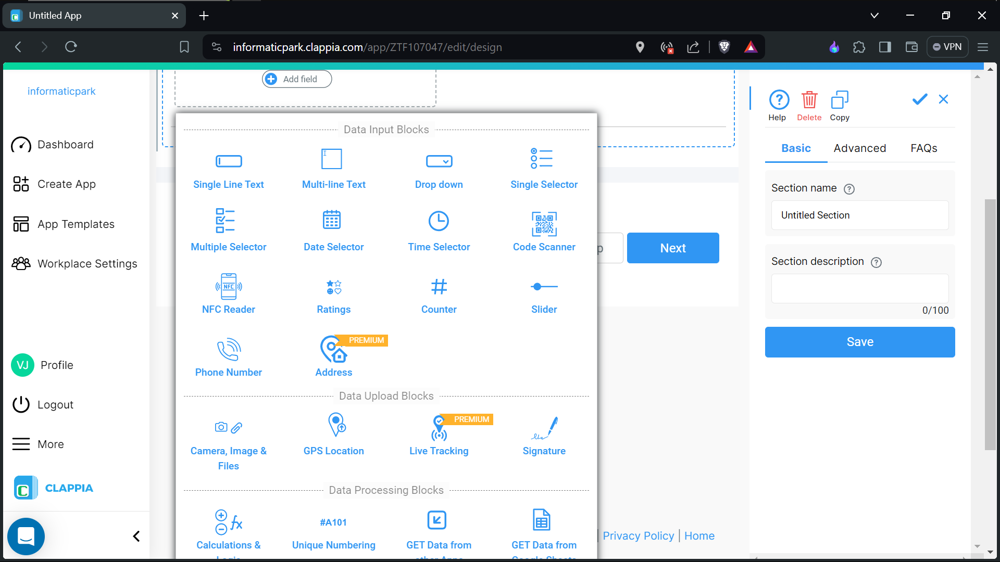

## De las requerimentaciones

En esta ocasión necesitamos geoposicionar los equipos informaticos pertenecientes a la Gobernación Provincial de Morona Santiago para los cual necesitamos generar un formulario personalizado con la integracion de google maps para que los usuarios puedan posicionar su ubicación en el mapa y enviar los equipos que tienen en su posesión. De esta manera nosotros tendremos acceso a la ubicación precisa del equipo para posteriormente ubicarlos en Google Maps.

La estructura de nuestro formulario esta compuesta por 3 secciones

1. La primera seccion contendra campos para llenar con la **ubicación**.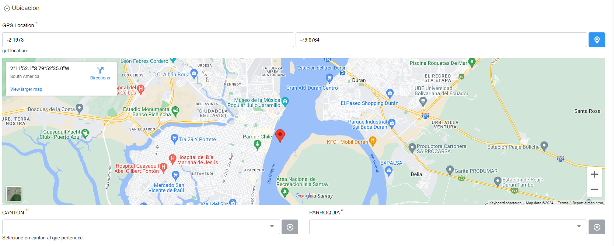
2. La segunda sección contendrá los campos a llenar correspondientes a los **equipos informaticos** disponibles.
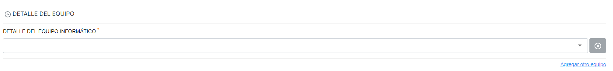
3. En esta ultima sección requeriremos la **información del usuario** que envie los datos a través del formulario.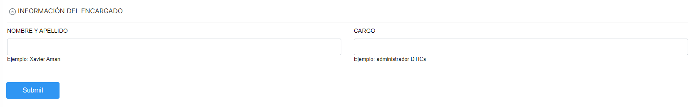

## Configurando la primera sección - Ubicación
Damos clic en la opcion **add new section** para crear la primera sección y la seleccionamos una vez creada

 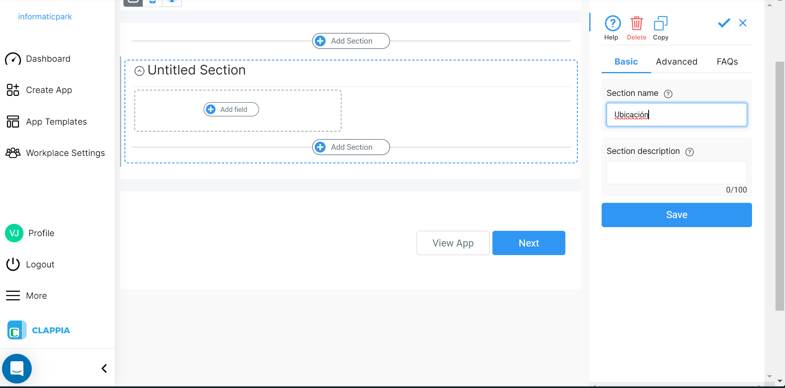

Cuando selecionamos la seccion nos aparecerá una barra lateral derecha la cual tiene las propiedades de la sección y las opciones para configurarla para lo cual primeramente vamos a renombre a la seccion a  con el nombre **Ubicación** y le damos clic en **Save** para guardar los cambios

Ahora dentro de la sección damos clic en  **add field** *(para agregar un componente)* denominado **GPS Location**

 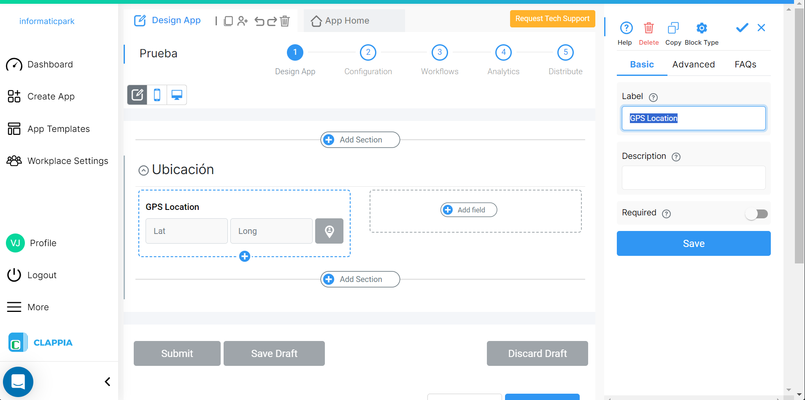 

de la misma manera tenemos un panel lateral derecho en donde se alojan las opciones para configurar el componente en donde dentro del mismo hay 3 pestañas, una pestaña para la configuración basica, otra para la configuración avanzada y la ultima de preguntas frecuentes.

En la pestaña **Basic** podremos agregarle un titulo al componente en este caso lo denominaremos **UBICACIÓN**.

Ahora nos posicionamos sobre la pestaña **Advanced** y habilitamos **Allow user to manually change location** para que el usuario pueda cambiar la direccion de la ubicacion en el mapa

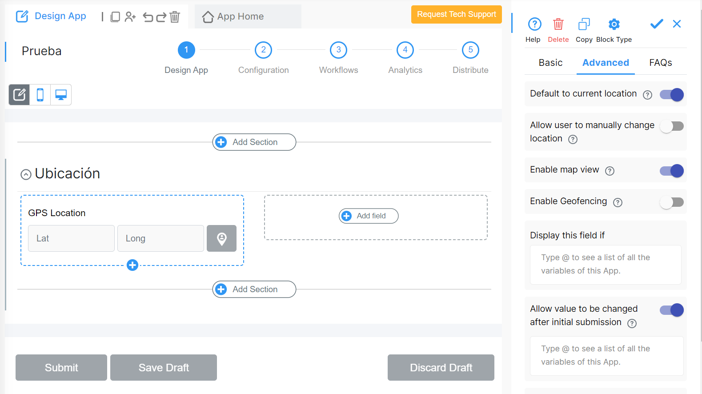

En consecuencia volvemos a dar clic en  **add field** *(para agregar un componente)* esta vez denominado **Drop down**

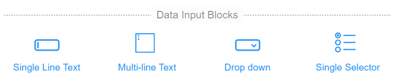

## Configurando la segunda sección - Equipos

## Configurando la tercera sección - Información del Usuario

